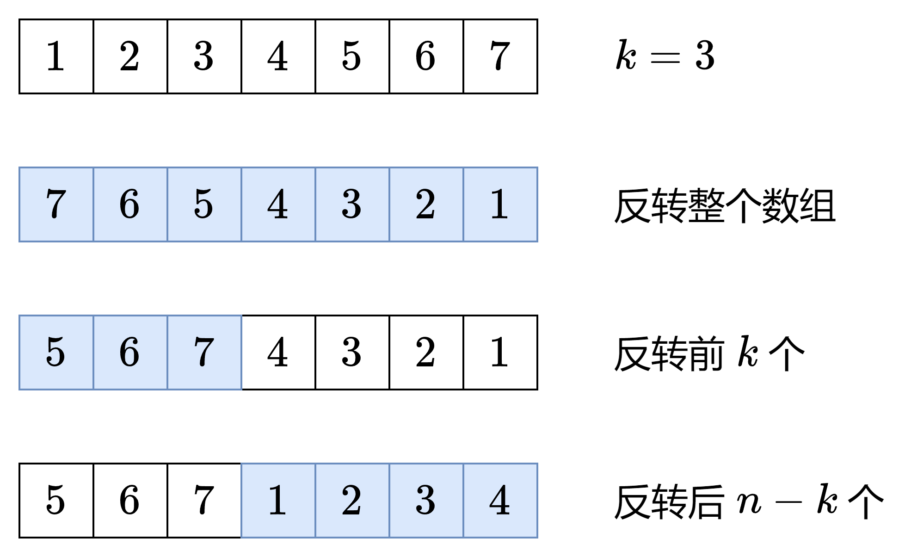

# 189. 轮换数组

题目：https://leetcode.cn/problems/rotate-array/


## 思路

### 方法一

使用原地转换的思路来实现，一直轮换，直到轮换 n 次。这里要注意若干个值轮换成环的问题。


### 方法二

三次反转




## 代码

### 方法一

```cpp
class Solution {
    private:
        int mod(int a, int b) {
            return (a % b + b) % b;
        }
    public:
        void rotate(vector<int>& nums, int k) {
            int n = nums.size();
            
            int start_i = 0, idx = 0, count = 0;
    
            // 从 start_i 开始
            while (count < n) { // 在进行 n 次交换后结束
                idx = start_i;
                int first = nums[idx];
    
                do {
                    nums[idx] = nums[mod(idx - k, n)]; // 轮转
                    idx = mod(idx - k, n);
                    count++;
                } while (idx != start_i);
    
                nums[mod(idx + k, n)] = first;
    
                start_i++;
            }
    
            return;
        }
    };
```


### 方法二

```java
class Solution {
    public void rotate(int[] nums, int k) {
        int n = nums.length;
        k %= n;
        reverse(nums, 0, n - 1);
        reverse(nums, 0, k - 1);
        reverse(nums, k, n - 1);
    }

    private void reverse(int[] nums, int i, int j) {
        while (i < j) {
            int temp = nums[i];
            nums[i++] = nums[j];
            nums[j--] = temp;
        }
    }
}
```