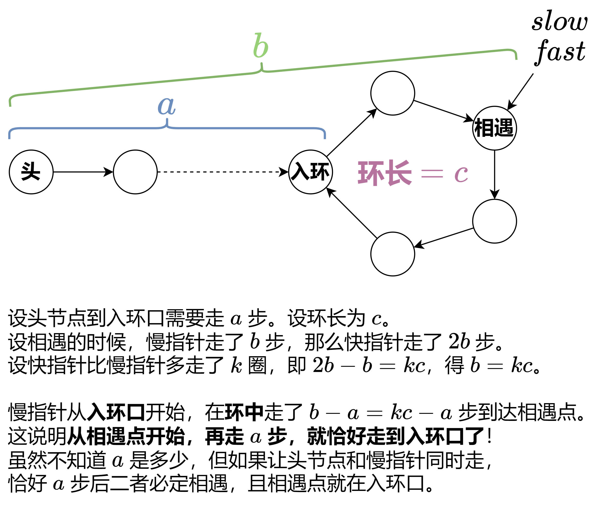

# 142. 环形链表

题目：https://leetcode.cn/problems/linked-list-cycle-ii/


## 思路

当然可以使用哈希来计算本题，C++ 语言使用 unordered_set，但是需要使用空间，效率不高

正确做法是使用快慢指针来解决这道题



对上图的解释：假设进环前的路程为 a，环长为 b。设慢指针走了 x 步时，快慢指针相遇，此时快指针走了 2x步。显然 2x-x=nb（快指针比慢指针多走了 n 圈），即 x=nb。也就是说慢指针总共走过的路程是 nb，但这 nb 当中，实际上包含了进环前的一个小 a，因此慢指针在环中只走了 nb-a 步，它还得再往前走 a 步，才是完整的 n 圈。所以，我们让**头节点**和慢指针同时往前走，当他俩相遇时，就走过了最后这 a 步。


## 代码

c++ 版本

```cpp
class Solution {
public:
    ListNode *detectCycle(ListNode *head) {
        ListNode* slow = head;
        ListNode* fast = head;
        while (fast && fast->next) {
            slow = slow->next;
            fast = fast->next->next;
            if (fast == slow) {
                while (slow != head) {
                    slow = slow->next;
                    head = head->next;
                }
                return slow;
            }
        }
        return nullptr;
    }
};
```

