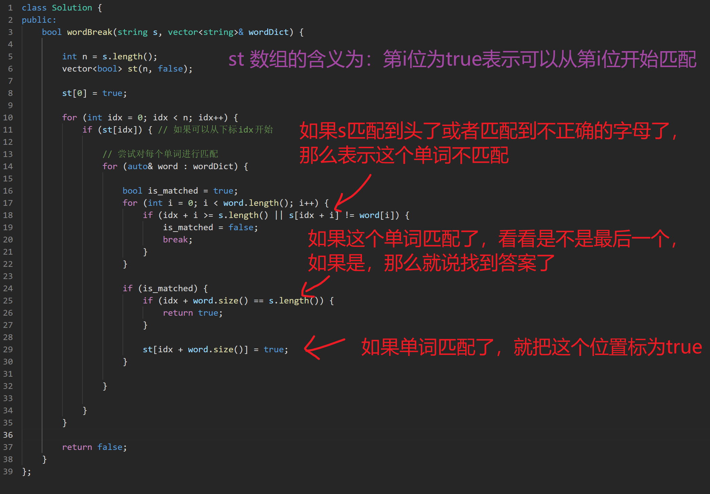

# 139.单词拆分

题目：[https://leetcode.cn/problems/word-break/](https://leetcode.cn/problems/word-break/)

## 思路1：

> 注意，此思路会超时！

整体类似于遍历的思路，先根据s来匹配满足条件的 word，然后根据后面应该接什么字母再从 wordDict 中找匹配的 word 接上去，如果找到末尾，那么返回 true，否则返回 false。

## 代码1：

```cpp
class Solution {
public:
    bool wordBreak(string s, vector<string>& wordDict) {
        
        queue<int> q;
        q.push(0);

        auto add_prefix_match = [&](int idx) -> bool {

            for (const auto& word : wordDict) {
                bool is_matched = true;
                for (int i = 0; i < word.length(); i++) {
                    if (idx + i >= s.length()) {
                        is_matched = false;
                        break;
                    }

                    if (word[i] != s[idx + i]) {
                        is_matched = false;
                        break;
                    }
                }
                if (is_matched && idx + word.length() == s.length()) return true;

                if (is_matched) q.push(idx + word.length());
            }

            return false;
        };

        while (!q.empty()) {
            
            auto elem = q.front();
            q.pop();

            bool res = add_prefix_match(elem);
            if (res) return true;
        }

        return false;
    }
};
```

---

## 思路2：



## 代码2：

```cpp
class Solution {
public:
    bool wordBreak(string s, vector<string>& wordDict) {
        
        int n = s.length();
        vector<bool> st(n, false);

        st[0] = true;

        for (int idx = 0; idx < n; idx++) {
            if (st[idx]) { // 如果可以从下标idx开始

                // 尝试对每个单词进行匹配
                for (auto& word : wordDict) {

                    bool is_matched = true;
                    for (int i = 0; i < word.length(); i++) {
                        if (idx + i >= s.length() || s[idx + i] != word[i]) {
                            is_matched = false;
                            break;
                        }
                    }

                    if (is_matched) {
                        if (idx + word.size() == s.length()) {
                            return true;
                        }

                        st[idx + word.size()] = true;
                    }

                }

            }
        }

        return false;
    }
};
```