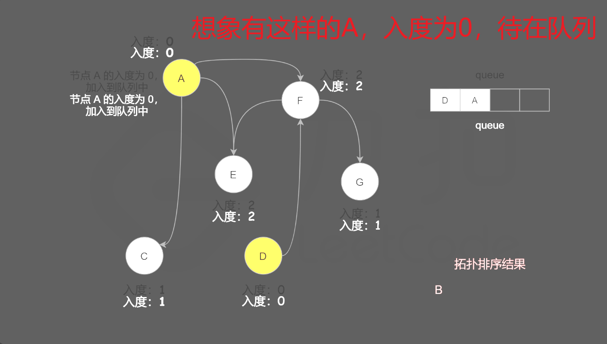

# 207.课程表

题目：[https://leetcode.cn/problems/course-schedule](https://leetcode.cn/problems/course-schedule)

## 思路

看这个视频了解广度优先搜索的方法：[课程表 LeetCode](https://leetcode.cn/problems/course-schedule/solutions/359392/ke-cheng-biao-by-leetcode-solution)

总结一下，总共需要两个数据结构，edges[u]={v1, v2, v3}，由 u 指向 v，还有个 indge 数组表示节点的入度数量。然后大体有三个流程，初始化，队列入队，处理队列。背吧~




循环逻辑为：visited++（我又访问到一个节点），拿到这个节点 u，把这个 u 指向的所有 v 都减一，如果发现谁入库为 0 了，再加到队列中。

```cpp
class Solution {
public:
    bool canFinish(int numCourses, vector<vector<int>>& prerequisites) {
        vector<vector<int>> edges(numCourses);
        vector<int> indeg(numCourses);

        for (auto& p : prerequisites) {
            edges[p[1]].push_back(p[0]); // edges[u] = {v};
            indeg[p[0]]++; // v 的入度++
        }

        queue<int> q;
        for (int i = 0; i < numCourses; i++) {
            if (indeg[i] == 0) {
                q.push(i);
            }
        }

        int visited = 0;
        while (!q.empty()) {
            visited++;
            auto u = q.front();
            q.pop();

            for (int v : edges[u]) {
                indeg[v]--;
                if (indeg[v] == 0) {
                    q.push(v);
                }
            }
        }

        return visited == numCourses;
    }
};
```