# C++虚函数表实现机制

[C++虚函数表实现机制以及用C语言对其进行的模拟实现 - 陪她去流浪](https://blog.twofei.com/496/)

### 虚函数的好处

可以定义一个基类的指针, 其指向一个继承类, 当通过基类的指针去调用函数时, 可以在运行时决定该调用基类的函数还是继承类的函数。

### 虚函数对内存布局的影响

#### 1. 没有虚函数的对象

```cpp
class Base1
{
public:
    int base1_1;
    int base1_2;

    void foo(){}
};
```

结果如下:

| 字段                       | 偏移 |
| -------------------------- | ---- |
| `sizeof(Base1)`            | 8    |
| `offsetof(Base1, base1_1)` | 0    |
| `offsetof(Base1, base1_2)` | 4    |

分析：如果一个函数不是虚函数,那么他就不可能会发生动态绑定,也就不会对对象的布局造成任何影响。

<br>

#### 2. 拥有仅一个虚函数的类对象

```cpp
class Base1
{
public:
    int base1_1;
    int base1_2;

    virtual void base1_fun1() {}
};
```

结果如下:

| 字段                       | 偏移 |
| -------------------------- | ---- |
| `sizeof(Base1)`            | 12   |
| `offsetof(Base1, base1_1)` | 4    |
| `offsetof(Base1, base1_2)` | 8    |

分析：

- 多了4个字节， `base1_1` 和 `base1_2` 的偏移都各自向后多了4个字节，说明类对象的最前面被多加了4个字节的东西。
- `base1_1` 前面多了一个变量 `__vfptr` (常说的虚函数表 vtable 指针), 其类型为`void**`, 表示它是一个**指向指针数组的指针**，而不是 **指针数组** 

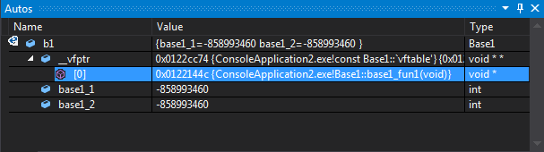

`__vfptr`的定义伪代码大概如下：

```cpp
void*        __fun[1] = { &Base1::base1_fun1 };
const void** __vfptr = &__fun[0];
```

<br>

#### 3. 拥有多个虚函数的类对象

```cpp
class Base1
{
public:
    int base1_1;
    int base1_2;

    virtual void base1_fun1() {}
    virtual void base1_fun2() {}
};
```

大小以及偏移信息如下:

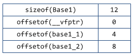

分析：

- 多了一个虚函数， 类对象大小保持和只有一个虚函数类对象大小相同。
- `__vfptr`所指向的函数指针数组中出现了第2个元素, 其值为`Base1`类的第2个虚函数`base1_fun2()`的函数地址。

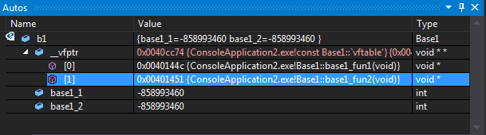

- 说明了`__vfptr`是一个指针, 指向一个函数指针数组（即虚函数表），多一个虚函数，只是会向虚函数表中增加一项，不会改变类对象大小

现在, 虚函数指针以及虚函数表的伪定义大概如下:

```cpp
void*        __fun[] = { &Base1::base1_fun1, &Base1::base1_fun2 }; 
const void** __vfptr = __fun[0];
```

- 一个类实例化出来的两个变量的地址肯定是不同的，但他们的 __vfptr 指向是同一个虚函数表

  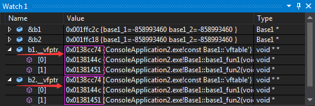

说明：**同一个类的不同实例共用同一份虚函数表, 她们都通过一个所谓的虚函数表指针`__vfptr`(定义为`void**`类型)指向该虚函数表.**

- 对象内存布局

  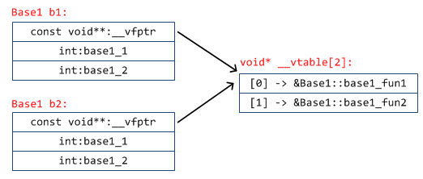

<br>

> 开始考虑单继承情况

#### 4. 单继承且本身不存在虚函数的继承类的内存布局

```cpp
class Base1
{
public:
    int base1_1;
    int base1_2;

    virtual void base1_fun1() {}
    virtual void base1_fun2() {}
};

class Derive1 : public Base1
{
public:
    int derive1_1;
    int derive1_2;
```

内存布局(定义为`Derive1 d1`):

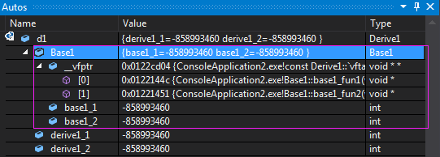

分析：

- __vfptr 放在父类里边

- 内存布局如下

  

<br>

#### 5. 子类没创建新的虚函数，只是覆盖基类虚函数的单继承类

```cpp
class Base1
{
public:
    int base1_1;
    int base1_2;

    virtual void base1_fun1() {}
    virtual void base1_fun2() {}
};

class Derive1 : public Base1
{
public:
    int derive1_1;
    int derive1_2;

    // 覆盖基类函数
    virtual void base1_fun1() {}
};
```

虚函数覆盖下的内存布局

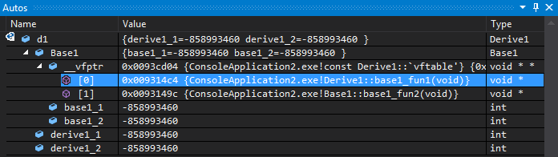

- 高亮处原先的 `Base1::base1_fun1()`, 但由于**继承类重写**了基类`Base1`的此方法, 所以现在变成了`Derive1::base1_fun1()`!
- 此时，无论是通过`Derive1`的指针还是`Base1`的指针来调用此方法, 调用的都将是**被继承类重写后的那个方法(函数), 多态发生了!!!**

- 内存布局

  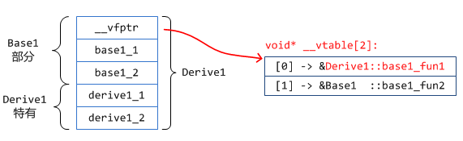

<br>

#### 6. 定义了基类没有的虚函数的单继承的类对象布局

```cpp
class Base1
{
public:
    int base1_1;
    int base1_2;

    virtual void base1_fun1() {}
    virtual void base1_fun2() {}
};

class Derive1 : public Base1
{
public:
    int derive1_1;
    int derive1_2;

    virtual void derive1_fun1() {}
};
```

按理来说，应该添加在 __vfptr 指向的函数指针数组中，添加一条指向子类虚函数的结果，事实确实如此

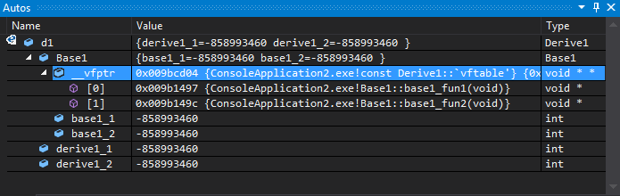

分析：

- 当前 Base1 看不到这个 [2]，是因为`Base1`只知道自己的两个虚函数索引`[0][1]`, 所以就算在后面加上了`[2]`, `Base1`根本不知情, 不会对她造成任何影响。

- 内存布局应该是这样

  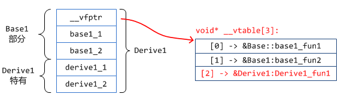

<br>

> 开始考虑多继承情况

#### 多继承且存在虚函数覆盖同时又存在自身定义的虚函数的类对象布局

```cpp
class Base1
{
public:
    int base1_1;
    int base1_2;

    virtual void base1_fun1() {}
    virtual void base1_fun2() {}
};

class Base2
{
public:
    int base2_1;
    int base2_2;

    virtual void base2_fun1() {}
    virtual void base2_fun2() {}
};

// 多继承
class Derive1 : public Base1, public Base2
{
public:
    int derive1_1;
    int derive1_2;

    // 基类虚函数覆盖
    virtual void base1_fun1() {}
    virtual void base2_fun2() {}

    // 自身定义的虚函数
    virtual void derive1_fun1() {}
    virtual void derive1_fun2() {}
};
```

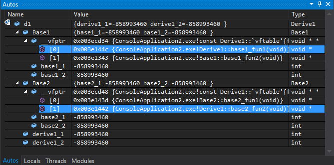

分析：

- 继承几个基类，就应该有几个 __vfptr，分别存在对应基类中

- 内存布局（图片右上角应该是 `void* __vftable[4]`）

  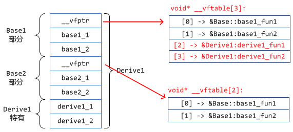

<br>

#### 如果第1个直接基类没有虚函数(表)的多继承

```cpp
class Base1
{
public:
    int base1_1;
    int base1_2;
};

class Base2
{
public:
    int base2_1;
    int base2_2;

    virtual void base2_fun1() {}
    virtual void base2_fun2() {}
};

// 多继承
class Derive1 : public Base1, public Base2
{
public:
    int derive1_1;
    int derive1_2;

    // 自身定义的虚函数
    virtual void derive1_fun1() {}
    virtual void derive1_fun2() {}
};
```

类的布局情况：

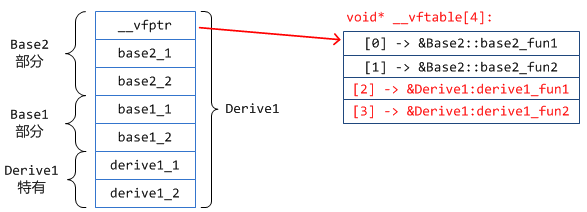

- 不难想象，基类有虚函数的应该有 __vfptr 虚函数表指针，基类没有虚函数的没有
- 谁有虚函数表，谁就会放在前面

<br>

#### 两个基类都没有虚函数表

```cpp
class Base1
{
public:
    int base1_1;
    int base1_2;
};

class Base2
{
public:
    int base2_1;
    int base2_2;
};

// 多继承
class Derive1 : public Base1, public Base2
{
public:
    int derive1_1;
    int derive1_2;

    // 自身定义的虚函数
    virtual void derive1_fun1() {}
    virtual void derive1_fun2() {}
};
```

内存布局：
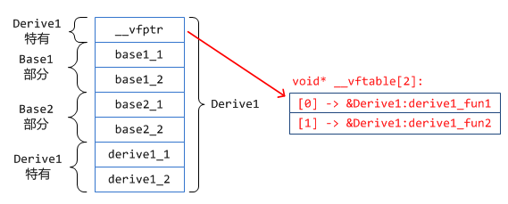

- __vfptr已经独立出来了, 不再属于`Base1`和`Base2`，并放在了前面

<br>

#### 函数调用

- 如果不是虚函数, 直接调用指针对应的基本类的那个函数
- 如果是虚函数, 则查找虚函数表, 并进行后续的调用. 虚函数表在定义一个时, 编译器就为我们创建好了的. 所有的, 同一个类, 共用同一份虚函数表.