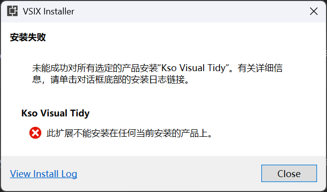
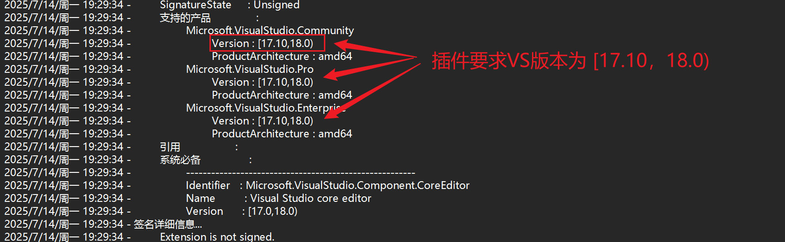
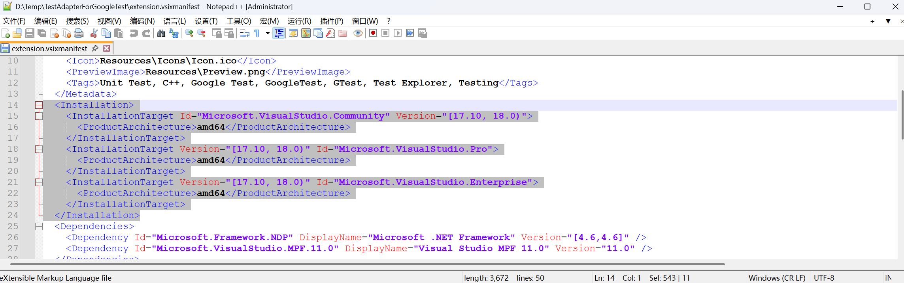

# VS2022 扩展安装问题

### Visual Studio 2022 在安装扩展过程中出现了版本问题

具体报错

> 此扩展模块无法安装在任何当前已安装的产品上
>
> this extension is not installable on any currently installed products
>
> 

原因是由于插件的版本和VS的版本冲突导致的，通过查看报错信息，我们可以发现

但是呢，我们的VS2019/VS2022版本不在这个范围里。这时候就有两种办法，第一种就是去 marketplace 安装最新，但一般解决不了，这时就可以通过修改插件里的版本来解决。

 

解决方法是，将下载的 vsix 文件解压，然后修改其中的 extension.vsixmanifest 里的版本内容，然后再压缩。

修改这里的范围到自己的VS范围，然后再压缩，然后再安装，就好了 ~~~