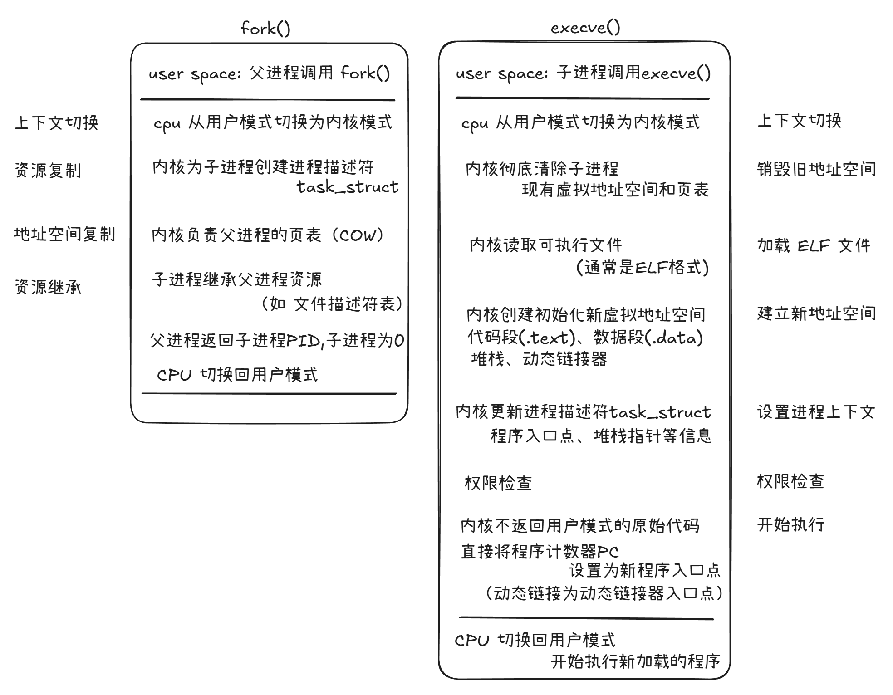

# Linux 内核分析

> Linux 的世界中，进程受操作系统调度切换执行提供程序执行环境；应用程序在磁盘中加载到内存后占用CPU时间片执行。那么 linux 内核是进程或是应用程序吗？都不算是。

## 内核不是进程，是什么

linux 操作系统启动后，引导程序会被加载，内核就会在 `start_kernel()` 中开始执行，并在以后始终存在。这样，它就不再是作为任务独立运行，而是成为了一个响应式执行层。于是可以得到以下结论：
1. linux 内核不是进程，不被调度。
2. 内核始终存在，作为一个响应式执行层，在需要时被调用。

> 那么内核会在哪些情况时被调用呢？

### 内核代码的调用时机
1. 通过用户进程发起的系统调用（syscall）
2. 通过硬件触发的中断处理程序 （interrupt handlers）
3. 在内核空间中长期存在的**内核线程**（kernel threads）

> ### 内核线程
> 
> 比如内存回收、I/O调度，它们是由内核自身创建和管理的**线程**，处理后台任务，它们不是用户空间的守护进程，也从不执行用户空间的代码。
> 
> 你可以在进程列表中看到内核线程，比如PID为2的线程`kthreadadd`，负责生成其它内核线程。`PID 1` (init 或 systemd) 启动用户空间，`PID 2` 标志着内核线程运行的开始。
> 
> 内核线程的数量不固定，随着系统的活跃，会为 I/O、内存管理、文件系统和设备驱动程序创建额外的线程。

## 为进程服务，是内核的首要职责

内核存在的意义是为用户进程服务。

### 例子1：启动一个进程，会发生什么

大体就是两个系统调用：`fork()` 和 `execve()`

在进程启动的过程中，用户调用 exec，内核通过 VFS 解析二进制路径、使用底层文件系统驱动程序加载文件、使用内存管理程序分配并映射内存、通过安全模块验证访问权限，并将进程调度为可执行状态。

### 例子2：进程调度

进程在用户空间运行，但其生命周期由内核管理。
- 内核的调度器(Scheduler)决定哪个进程在哪个 CPU 上运行。
- 进程运行过程中访问内存，若发生缺页中断，内核负责从磁盘中加载页到物理内存中。

由此可见，**用户线程的运行需要内核各个子系统协同工作来完成**。而内核存在的意义，就是为了用户线程提供服务。

## 内核代码设计遵循一些前提

linux 内核并非按照功能的简单堆砌，而是要考虑诸多系统级需求，如安全、隔离、确定性、容错。

可以执行的操作在不同场景下是不一样的，内核入口的进入方式（系统调用、异常、中断、内核线程）决定了不同的执行规则。举个例子，规则为`中断上下文限制`，在硬件中断触发的情形下（如网卡接收数据），中断上下文的代码是不允许睡眠或阻塞的。再举个例子，规则为`内核抢占与同步` ，具体是当一个CPU获取自旋锁时，其抢占会被关闭。原因是保证并发条件下的正确性，如果当前任务在持有锁正在执行任务时，被另一个任务中断，那么这个锁可能永远无法释放。

为了保证隔离性，每个线程被设计为拥有自己的内核上下文。内核可以访问线程的内存映射（mm_struct）、打开的文件（files_struct）、信号状态（signal_struct）和权限（cred）。

内存分配也需要考虑不同上下文。比如需要根据上下文来确定分配模式，是 `GFP_ATOMIC `不可阻塞，还是`GFP_KERNEL` 可阻塞的。

内核必须在错误中保持稳定。用户的输入应该检查、故障应当被隔离，等等。

## 内核是分层系统

内核避免使用全局状态，而是通过分层、抽象和间接机制来管理资源和执行任务。

内核的执行是与任务和调度上下文绑定的。任务是通过调度器调度的，由调度器来让任务被排队、分配、抢占。

内核遍布抽象与接口。用户空间通过系统调用接口切换到内核态执行，VFS抽象文件系统，块层抽象设备，网络栈抽象协议，很多接口只定义了行为而不暴露实现。

### 访问时通过映射和抽象

比如在访问路径的解析中，比如访问 `/home/user/data.txt` 这样的路径，内核会将其解析为可以操作的数据结构。根据路径（Path）内容，通过 dentry 来查找目录和缓存，然后找到对应索引节点 inode，inode上有存储文件的元数据，文件类型、权限、大小、在磁盘上的位置等，这体现了映射的过程。

比如在文件访问中，当一个程序成功打开一个文件时，内核会为这个文件分配一个句柄供程序使用。过程中涉及到两种东西，一个是`文件描述符（File Descriptor，FD）`，另一个是`文件结构体（struct file）` 。文件描述符就是一个非负整数，就是用户空间访问文件或I/O资源的抽象**句柄**，它是用户空间看到和使用的；文件结构体是内核空间的数据结构，代表一个被打开的文件实例。那么文件访问中的映射过程是怎么样的呢？进程的文件描述符表是一个数组，它将用户空间使用的 FD 映射到内核空间中一个特定的 `struct file` 实例。

> 文件描述符：比如标准输入是0，标准输出是1，标准错误是2，它是用户空间访问文件或I/O资源的抽象句柄。
> 
> 文件结构体包含的信息有：当前文件的读写偏移量、访问权限、对应的 `dentry`和操作函数指针 `f_op`。

比如在内存访问中，有虚拟地址到物理页面的转换。程序在用户空间看到的都是虚拟地址，每个进程都有自己独立的虚拟地址空间。内核通过页表（Page Table）维护虚拟地址（VA）到物理地址（PA）的映射关系；MMU 接收 VA，查询进程的页表，将 VA 转换为 PA；页表项指示该 VA 尚未加载到物理内存中，将触发缺页中断，由内核从磁盘（或交换分区）加载对应的物理页面。

### 间接性强制分离

“间接性”是内核管理和控制一切的手段，它意味着内核决不相信任何来自用户空间或外部的直接请求，所有操作都必须通过由内核定义的带有检查和检验的“门”或“中介”来进行。

比如在对执行行为的路由中，使用函数表（Function Tables）。用户程序调用 `read()` 或 `write()` ，系统首先 Trap 陷入内核，然后内核根据文件描述符找到对应的`file struct` ，再通过`file struct`找到它绑定的操作函数表`f_op` ，然后执行对应的`read`或`write`函数（如 ext4 文件系统的 read 函数，或网络接套字的 read 函数）。

比如在进程资源访问时，内核通过 `task_struct` 结构体（代表一个进程）来管理和访问进程的资源。这个结构体中既有指向文件系统上下文（fs__struct_）、打开的文件表（file_struct）的指针，又有指向内存管理结构（mm_struct）的指针。这意味着内核始终通过当前正在执行的 `task_struct` 来间接访问和修改资源，这保证了进程A无法直接访问或修改进程B的私有资源，除非内核明确允许。

比如在内核访问用户空间内存时，采用请求而非直接访问。内核不能简单地使用指针直接访问用户空间地址，因为地址可能是无效的、权限不正确的。所以用户空间内存对于内核而言，不能直接解引用，它被视为一种“请求”的数据。实现中，会使用`copy_from_user() `和`copy_to_user()` ，这些函数会进行严格的检查：地址有效性检查、页表权限检查、异常处理。

## 单体形式，协同行为

内核被构建为一个二进制文件，共享一个地址空间。整体对外采用不信任的态度，并愿意耗费性能以换取安全性；对于内核内部，程序是可信任的，所以内部采用一系列直接的函数调用和对共享数据结构的直接指针操作以追求高性能。